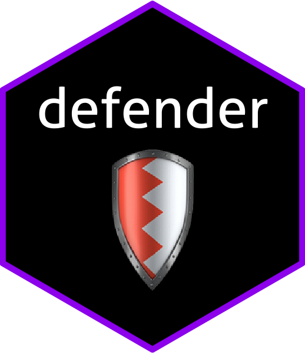

<!-- README.md is generated from README.Rmd. Please edit that file -->
defender 
========================================================

[](https://travis-ci.org/ropenscilabs/defender) [](https://codecov.io/github/ropenscilabs/defender?branch=master)

The goal of defender is to do static code analysis on other R packages to check for potential security risks and best practices. It provides checks on multiple levels:

1.  \[x\] static code analysis without installing the package
2.  \[ \] more thorough but potentially dangerous checks with installation / in Docker container

The checks do not tell you whether something is harmful but rather they flag code that you should double-check before running / loading the package.

Installation
------------

You can install defender from github with:

``` r
# install.packages("devtools")
devtools::install_github("ropenscilabs/defender")
```

Example
-------

### System calls in R scripts

You can check for system calls in any directory locally available:

``` r
defender::summarize_system_calls("../testevil")
#>   line1 col1 line2 col2 id parent                token terminal    text
#> 1     1    1     1    7  1      3 SYMBOL_FUNCTION_CALL     TRUE system2
#> 2     4    3     4    8 23     25 SYMBOL_FUNCTION_CALL     TRUE  system
#> 3     7    5     7   11 27     29 SYMBOL_FUNCTION_CALL     TRUE system2
#> 4     4    3     4    8 35     37 SYMBOL_FUNCTION_CALL     TRUE  system
#> 5     8    3     8    8 66     68 SYMBOL_FUNCTION_CALL     TRUE  system
#> 6     3   23     3   25 18     19 SYMBOL_FUNCTION_CALL     TRUE     run
#> 7     2   14     2   20 25     27 SYMBOL_FUNCTION_CALL     TRUE system2
#>                path
#> 1   inst/root_sys.R
#> 2   inst/root_sys.R
#> 3      R/exported.R
#> 4      R/internal.R
#> 5      R/internal.R
#> 6      R/processx.R
#> 7 R/system_hidden.R
```

You can also include additional elements to flag as dangerous:

``` r
sc <- defender::system_calls("poll")
defender::summarize_system_calls("../testevil", calls_to_flag = sc)
#>   line1 col1 line2 col2 id parent                token terminal    text
#> 1     1    1     1    7  1      3 SYMBOL_FUNCTION_CALL     TRUE system2
#> 2     4    3     4    8 23     25 SYMBOL_FUNCTION_CALL     TRUE  system
#> 3     7    5     7   11 27     29 SYMBOL_FUNCTION_CALL     TRUE system2
#> 4     4    3     4    8 35     37 SYMBOL_FUNCTION_CALL     TRUE  system
#> 5     8    3     8    8 66     68 SYMBOL_FUNCTION_CALL     TRUE  system
#> 6     3   23     3   25 18     19 SYMBOL_FUNCTION_CALL     TRUE     run
#> 7     9   13     9   16 58     60 SYMBOL_FUNCTION_CALL     TRUE    poll
#> 8     2   14     2   20 25     27 SYMBOL_FUNCTION_CALL     TRUE system2
#>                path
#> 1   inst/root_sys.R
#> 2   inst/root_sys.R
#> 3      R/exported.R
#> 4      R/internal.R
#> 5      R/internal.R
#> 6      R/processx.R
#> 7      R/processx.R
#> 8 R/system_hidden.R
```

### System-related imports in NAMESPACE

You can check the NAMESPACE file in a package for dangerous imports:

``` r
defender::check_namespace("../testevil")
#>       type        import  package
#> 1  package           sys      sys
#> 2  package      processx processx
#> 3 function processx::run processx
```

You can also include additional elements to flag as dangerous:

``` r
di <- defender::dangerous_imports("processx::poll")
defender::check_namespace("../testevil", imports_to_flag = di)
#>       type         import  package
#> 1  package            sys      sys
#> 2  package       processx processx
#> 3 function processx::poll processx
#> 4 function  processx::run processx
```
